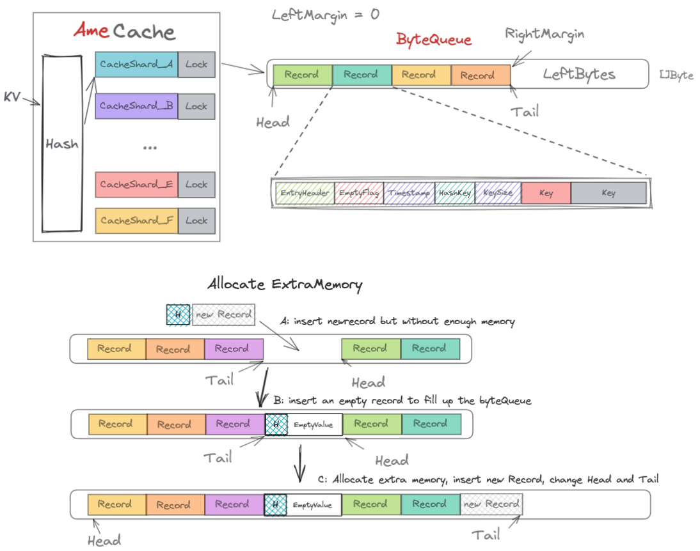

# AmeCache - Simple High-Performance Local Cache

Implementation of various local Cache and test it benchmark performance

following [Tour](https://github.com/go-programming-tour-book/cache-example).

Based on them, reimplement a high-performance Cache according to BigCache, Considering  sharding Lock and GC optimization

I call it Ame Cache, `Ame` is the ID of Carry from LGD Dota2 Esport Team.


### Intro

**SCache**

Simple Cache. It implement three kind of cache strategies, `LRU` ; `LFU` ; `FIFO`. However, it use only one Lock to ensure the thread-safe. Geting Lock and releasing Lock will cost many performance overhead

**FCache**

Fast Cache. It optimize the performance through sharding records. Thus, two records from different shards won't share one lock. It improves the performance in Parallel Operation.


**AmeCache**

Copy the design pattern of bigCache. 

Shard lock can help to relieve the load of concurrent lock. 

Considering the GC optimization, only use basic data type in `map`. When Go version > 1.5, GC will regard map as only one object if the map only contains basic data type like different kinds of Integar type. So create a special data structure: bytequeue. It is an FiFO-like byte circle queue. For any k-v pair, AmeCache will serialize it into a record, and insert it into the ByteQueue. The index only maps the hash value of the key into the record's position in the byteQueue. Thus the index map only contains int type. During the GC process, the map will be treated as an object.

As for cache strategy, it implements FIFO. However, when allocating extra memory, it will change the tail and head pointer, which will break the FIFO rules. You can check the whole process in the below figure.




### Benchmark Test

```shell
$ cd test/benchmark
$ go test -bench=. -benchmem ./... -timeout 30m
```


```shell
goos: darwin
goarch: amd64
pkg: github.com/lingze/localCache/test/benchmark
cpu: Intel(R) Core(TM) i5-7267U CPU @ 3.10GHz
BenchmarkMapSet-4                      	 2574151	       470.1 ns/op	     208 B/op	       2 allocs/op
BenchmarkSimpleCacheSet-4              	 1274461	       860.3 ns/op	     337 B/op	       6 allocs/op
BenchmarkFastCacheSet-4                	 2236088	       575.1 ns/op	     240 B/op	       6 allocs/op
BenchmarkConcurrentMapSet-4            	 1000000	      1471 ns/op	     339 B/op	       8 allocs/op
BenchmarkBigCacheSet-4                 	 2131330	       645.4 ns/op	     340 B/op	       2 allocs/op
BenchmarkAmeCacheSet-4                 	 1864418	       635.0 ns/op	     353 B/op	       2 allocs/op

BenchmarkMapGet-4                      	 3877886	       346.6 ns/op	      23 B/op	       1 allocs/op
BenchmarkSimpleCacheGet-4              	 3217207	       376.6 ns/op	      23 B/op	       1 allocs/op
BenchmarkFastCacheGet-4                	 5540294	       214.8 ns/op	      24 B/op	       1 allocs/op
BenchmarkConcurrentMapGet-4            	 2957997	       411.7 ns/op	      23 B/op	       1 allocs/op
BenchmarkBigCacheGet-4                 	 2541733	       494.0 ns/op	     151 B/op	       3 allocs/op
BenchmarkAmeCacheGet-4                 	 2986725	       401.2 ns/op	      23 B/op	       1 allocs/op

BenchmarkSimpleCacheSetParallel-4      	 1000000	      1178 ns/op	     369 B/op	       6 allocs/op
BenchmarkFastCacheSetParallel-4        	 3458870	       345.4 ns/op	     244 B/op	       6 allocs/op
BenchmarkConcurrentMapSetParallel-4    	 3468811	       353.1 ns/op	     190 B/op	       5 allocs/op
BenchmarkBigCacheSetParallel-4         	 4113654	       311.6 ns/op	     349 B/op	       3 allocs/op
BenchmarkAmeCacheSetParallel-4         	 3922638	       398.0 ns/op	     357 B/op	       3 allocs/op

BenchmarkSimpleCacheGetParallel-4      	 8150322	       165.3 ns/op	      23 B/op	       1 allocs/op
BenchmarkFastCacheGetParallel-4        	10355632	       131.4 ns/op	      24 B/op	       1 allocs/op
BenchmarkConcurrentMapGetParallel-4    	 3260037	       549.2 ns/op	      23 B/op	       1 allocs/op
BenchmarkBigCacheGetParallel-4         	 5215998	       197.8 ns/op	     151 B/op	       3 allocs/op
BenchmarkAmeCacheGetParallel-4         	 8396762	       187.4 ns/op	      23 B/op	       1 allocs/op

BenchmarkSimpleCacheSetGetParallel-4   	 1000000	      1627 ns/op	     399 B/op	       9 allocs/op
BenchmarkFastCacheSetGetParallel-4     	 2220926	       536.1 ns/op	     276 B/op	       9 allocs/op
BenchmarkConcurrentSetGetParallel-4    	  867662	      1998 ns/op	     394 B/op	      11 allocs/op
BenchmarkBigCacheSetGetParallel-4      	 2135581	       747.5 ns/op	     500 B/op	       7 allocs/op
BenchmarkAmeCacheSetGetParallel-4      	 2352194	       501.1 ns/op	     362 B/op	       4 allocs/op
```

